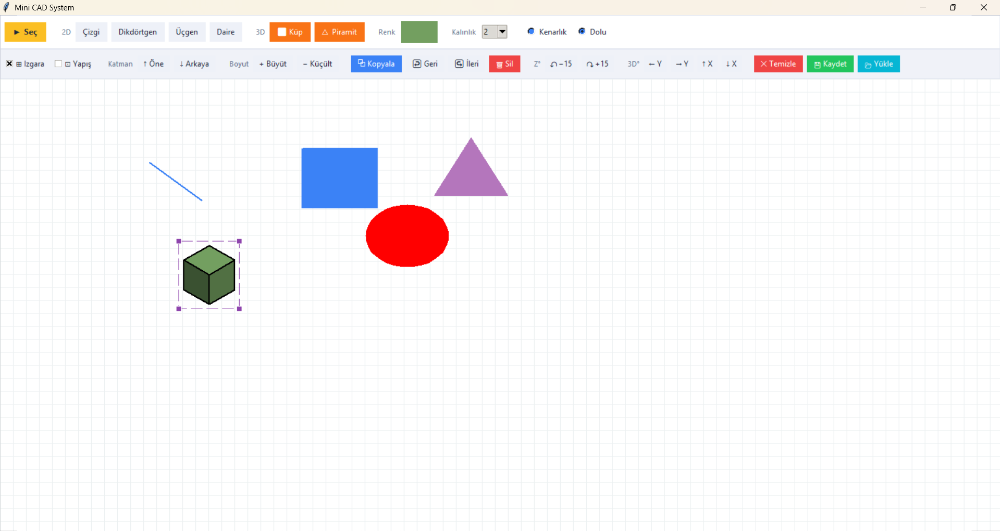
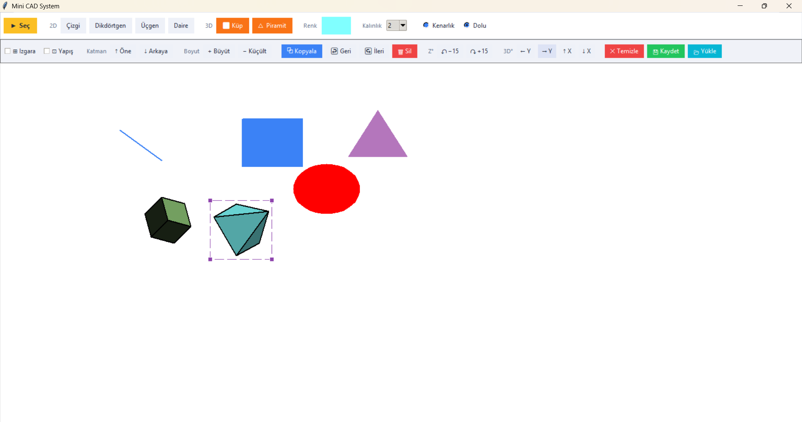
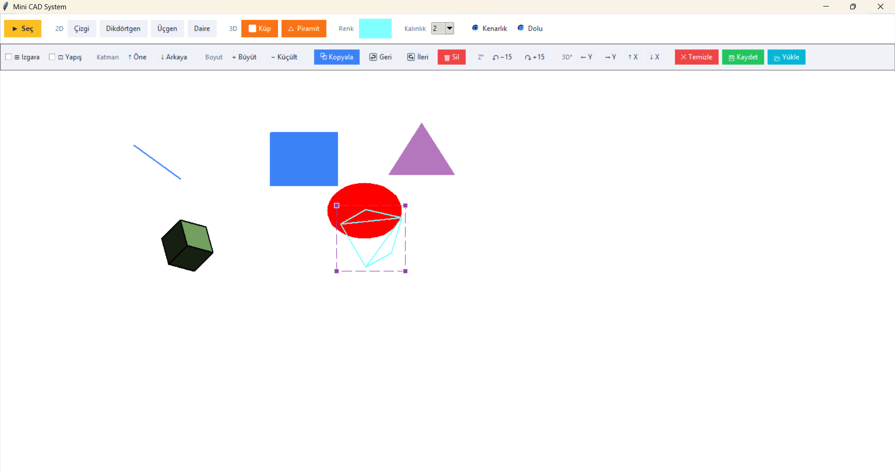

# Mini CAD System

A lightweight desktop CAD application developed with Python and Tkinter, featuring 2D drawing and 3D rendering capabilities.





---

## Features

### 2D Drawing Tools
- **Line** — freehand line drawing
- **Rectangle** — vertex-to-vertex drawing
- **Triangle** — creating triangular polygons
- **Circle** — drawing ellipses/circles (36-point polygon approximation)

### 3D Objects
- **Cube** — hexagonal, illuminated cube
- **Pyramid** — pentagonal pyramid
- Objects are initially placed at an isometric angle; Size adjustment via mouse drag
- All 3D faces are drawn in Z order with **Painter's Algorithm**
- Right mouse button + drag → **global 3D camera rotation**

### Selection and Editing
- **Resizing** objects by selecting and holding (corner handles)
- **Drag and move** the selected object
- **Z-axis rotation** (2D and 3D): in ±15° increments
- **3D object rotation**: X and Y axes separately
- **Scale**: 20% magnification / 20% reduction
- **Layer management**: Bring to front / Send to back
- **Copy** — duplicates the selected object in offset position
- **Delete** — removes the selected object

### Appearance and Style
- Color picker (Tkinter `colorchooser`)
- Border thickness (1 / 2 / 3 / 5 / 8 / 10 px)
- Switching between **Filled / Border** style
- Customizable grid (visible / hidden)
- **Snap to grid** mode

### History and File
- **Undo / Redo** — History up to 30 steps
- **Save / Load** — all drawings are saved in `.json` format

---

## File Structure

```
.
├── main.py # Main application — MiniCADApp class, UI setup, all event management
├── config.py # Color palette (COLORS) and font definitions (FONTS)
├── math_3d.py # 3D math helpers: normalize, cross/dot product, shade_color
└── ui_utils.py # Tkinter widget helpers: make_btn, add_hover, sep
```

### Module Responsibilities

| File | Responsibility |
|---|---|
| `main.py` | Application state, event loop, drawing and rendering logic |
| `config.py` | Centralized color and font constants |
| `math_3d.py` | Vector operations and surface shading calculations |
| `ui_utils.py` | Reusable button/separator creation functions |

---

## Requirements

- Python 3.8+

- Tkinter (Comes with Python's standard library; no additional installation required)

> **Note:** Tkinter may need to be installed separately on some Linux distributions:
> ```bash
> sudo apt install python3-tk
> ```

---

## Running

```bash
python main.py
```

The application opens at 1450x880 pixels.

---

## Keyboard Shortcuts

| Shortcut | Function |
|---|---|
| `Ctrl+C` | Copy selected object |
| `Ctrl+Z` | Undo |
| `Ctrl+Y` | Redo |
| `Delete` | Delete selected object |

---

## Save Format

Drawings are saved as JSON. Format:

```json
{ 
"2d":[ 
{ 
"type": "polygon", 
"coords": [100, 100, 200, 100, 200, 200, 100, 200], 
"fill": "#3b82f6", 
"outline": "#3b82f6", 
"width": "2" 
} 
], 
"3d":[ 
{ 
"id": "3d_0_1", 
"type": "cube", 
"cx": 400, "cy": 300, "size": 60, 
"rot_x": -0.6155, "rot_y": 0.7854, "rot_z": 0.0, 
"color": "#f97316", 
"style": "fill",
"width": 2,
"vertices": [...],
"faces": [...]
}
]
}
```

---

## Architectural Notes

- **3D Rendering:** All 3D objects are redrawn from scratch in each frame. Object rotation + global camera rotation are implemented using chain matrix transformations. Surface visibility is determined by backface culling (normal Z > 0); shading is based on diffuse light calculation.
- **History Management:** Before each modifier operation, the current 2D canvas state and 3D object list are added to the `history` stack by calling `save_state()`. A maximum of 30 steps are saved. - **Grid Snapping:** `get_snapped_coord()` rounds all mouse coordinates to the `grid_size` factor.
